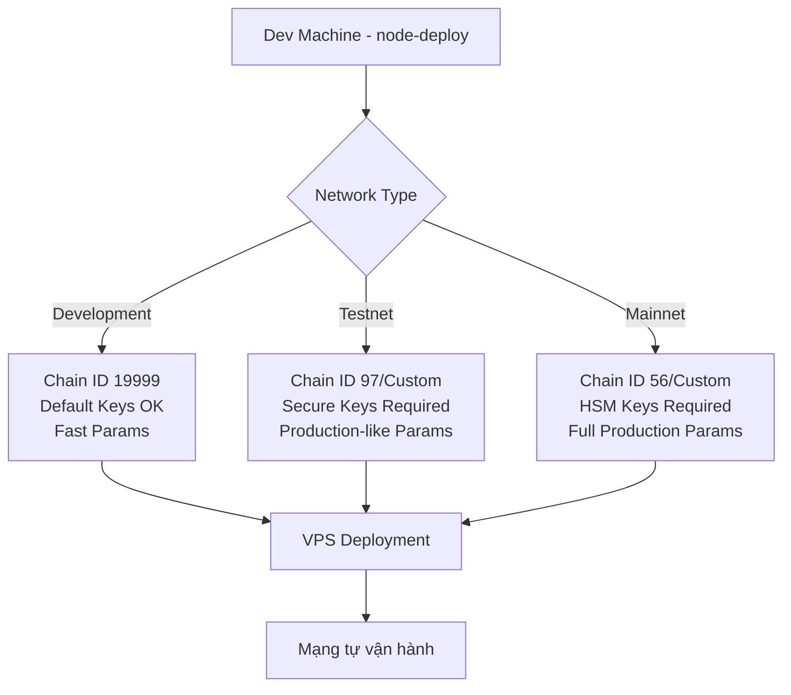

# 3. Workflow Triển Khai Production: Từ Node-Deploy Sang Testnet/Mainnet Độc Lập

## Tổng Quan

Hướng dẫn này giúp dev team thực hiện workflow hoàn chỉnh để khởi tạo mạng blockchain riêng:

1. **Giai đoạn 1**: Khởi tạo mạng Development/Testnet/Mainnet với `node-deploy`
2. **Giai đoạn 2**: Deploy validators + fullnode lên VPS/VDS riêng biệt
3. **Giai đoạn 3**: Migration và tắt node-deploy, để mạng tự vận hành

## 🎯 Các Loại Network Hỗ Trợ

### Development Network

- **Chain ID**: 19999 (customizable)
- **Mục đích**: Testing và development local
- **Keys**: Có thể sử dụng keys mặc định
- **Parameters**: Optimized cho development speed

### Testnet Network

- **Chain ID**: 97 (BSC Testnet compatible) hoặc custom
- **Mục đích**: Public testing và staging
- **Keys**: **BẮT BUỘC** sử dụng keys bảo mật từ [Generate Secure Keys](./2-generate-secure-keys.md)
- **Parameters**: Production-like settings với reduced penalties

### Mainnet Network

- **Chain ID**: 56 (BSC Mainnet compatible) hoặc custom
- **Mục đích**: Production blockchain
- **Keys**: **BẮT BUỘC** sử dụng HSM và keys bảo mật cao từ [Generate Secure Keys](./2-generate-secure-keys.md)
- **Parameters**: Full production settings



## 📋 Prerequisites

### Infrastructure Cần Thiết

```bash
# Development
- Local machine: 4GB RAM, 100GB disk
- Keys: Default keys OK

# Testnet
- VPS: 2-4 vCPUs, 8GB RAM, 500GB SSD per validator
- Keys: Secure keys từ guidelines/2-generate-secure-keys.md
- Network: Public IP, ports 30303, 8545, 8546

# Mainnet
- VPS: 4-8 vCPUs, 16GB RAM, 1TB SSD per validator
- Keys: HSM hoặc highest security keys
- Network: Premium bandwidth, DDoS protection
- Backup: Multi-location backup strategy
```

### Team Requirements

```bash
# Development
- [ ] Basic blockchain knowledge
- [ ] Access to dev machine

# Testnet
- [ ] Understanding of [Generate Secure Keys](./2-generate-secure-keys.md)
- [ ] Access to VPS/VDS servers
- [ ] SSH keys configured
- [ ] Basic Linux administration skills

# Mainnet
- [ ] All testnet requirements
- [ ] Professional security knowledge
- [ ] Hardware Security Modules (HSM)
- [ ] 24/7 monitoring capability
- [ ] Incident response procedures
```

## 🚀 Giai Đoạn 1: Khởi Tạo Mạng với Node-Deploy

### Bước 1.1: Chọn Network Type và Cấu Hình

#### 🔧 Development Network Configuration

```bash
# Trên dev machine
cd node-deploy/

# Tạo cấu hình Development
cat > .env << 'EOF'
BSC_CLUSTER_SIZE=4
CHAIN_ID=19999
KEYPASS="0123456789"
INIT_HOLDER="0x04d63aBCd2b9b1baa327f2Dda0f873F197ccd186"
# INIT_HOLDER_PRV="59ba8068eb256d520179e903f43dacf6d8d57d72bd306e1bd603fdb8c8da10e8"
RPC_URL="http://127.0.0.1:8545"
GENESIS_COMMIT="4e0cc71423adddcae475ed3c3819d9816a7d0245" # lorentz commit
PASSED_FORK_DELAY=20                  # Giảm delay cho development testing
LAST_FORK_MORE_DELAY=10
FullImmutabilityThreshold=1000        # Thấp hơn cho testing nhanh
MinBlocksForBlobRequests=32           # Giảm cho development
DefaultExtraReserveForBlobRequests=32
BreatheBlockInterval=600              # 10 phút (ngắn cho testing)
useLatestBscClient=false
EnableSentryNode=false
EnableFullNode=false
RegisterNodeID=false
EnableEVNWhitelist=false
EOF

echo "✅ Development configuration created"

# Lưu ý: Governance parameters (như unbond period, jail time, etc.)
# sẽ được truyền vào genesis generation commands, không lưu trong .env
```

#### 🌐 Testnet Network Configuration

```bash
# Tạo cấu hình Testnet
cat > .env << 'EOF'
BSC_CLUSTER_SIZE=6
CHAIN_ID=97
KEYPASS="[YOUR_SECURE_PASSWORD]"     # ⚠️ THAY ĐỔI PASSWORD!
INIT_HOLDER="[YOUR_SECURE_TESTNET_ADDRESS]"  # ⚠️ THAY ĐỔI ADDRESS!
# INIT_HOLDER_PRV="[YOUR_PRIVATE_KEY]"
RPC_URL="http://127.0.0.1:8545"
GENESIS_COMMIT="4e0cc71423adddcae475ed3c3819d9816a7d0245" # lorentz commit
PASSED_FORK_DELAY=0                  # No delay cho testnet
LAST_FORK_MORE_DELAY=0
FullImmutabilityThreshold=100000     # Cao hơn development
MinBlocksForBlobRequests=576         # Production-like setting
DefaultExtraReserveForBlobRequests=32
BreatheBlockInterval=86400           # 24 giờ (production-like)
useLatestBscClient=false
EnableSentryNode=false
EnableFullNode=false
RegisterNodeID=false
EnableEVNWhitelist=false
EOF

echo "✅ Testnet configuration created"
echo "⚠️  QUAN TRỌNG: Thay đổi INIT_HOLDER thành địa chỉ bảo mật của bạn!"
echo "📝 Governance parameters sẽ được config trong genesis generation step"
```

#### 🏛️ Mainnet Network Configuration

```bash
# Tạo cấu hình Mainnet
cat > .env << 'EOF'
BSC_CLUSTER_SIZE=21
CHAIN_ID=56
KEYPASS="[YOUR_HSM_SECURED_PASSWORD]"  # ⚠️ PHẢI DÙNG HSM PASSWORD!
INIT_HOLDER="[YOUR_HSM_SECURED_ADDRESS]"  # ⚠️ PHẢI DÙNG HSM ADDRESS!
# INIT_HOLDER_PRV="[YOUR_HSM_PRIVATE_KEY]"
RPC_URL="http://127.0.0.1:8545"
GENESIS_COMMIT="4e0cc71423adddcae475ed3c3819d9816a7d0245" # lorentz commit
PASSED_FORK_DELAY=0                  # No delay cho mainnet
LAST_FORK_MORE_DELAY=0
FullImmutabilityThreshold=1000000    # Cao cho security
MinBlocksForBlobRequests=576         # Production setting
DefaultExtraReserveForBlobRequests=32
BreatheBlockInterval=86400           # 24 giờ
useLatestBscClient=false
EnableSentryNode=true                # Enable sentry cho mainnet
EnableFullNode=false
RegisterNodeID=false
EnableEVNWhitelist=true              # Enable whitelist cho security
EOF

echo "✅ Mainnet configuration created"
echo "🚨 CRITICAL: Mainnet PHẢI sử dụng HSM và highest security practices!"
echo "📝 Governance parameters sẽ được config trong genesis generation step"
```

### Bước 1.2: Cập Nhật config.toml theo Network

```bash
# Cập nhật NetworkId trong config.toml
CHAIN_ID=$(grep "CHAIN_ID=" .env | cut -d'=' -f2)

echo "Updating config.toml với Chain ID: $CHAIN_ID"
sed -i.bak "s/NetworkId = .*/NetworkId = $CHAIN_ID/" config.toml

echo "✅ config.toml updated với Chain ID $CHAIN_ID"
```

### Bước 1.3: Tạo Production Keys

**⚠️ CRITICAL**: Keys phải được tạo theo network type!

#### Cho Development Network

```bash
echo "Development network - có thể sử dụng keys có sẵn hoặc tạo mới"

# Option 1: Sử dụng keys có sẵn (nhanh cho development)
if [ -d "keys/" ] && [ -f "keys/password.txt" ]; then
    echo "✅ Sử dụng keys có sẵn cho development"
else
    echo "Tạo keys mới cho development..."
    # Tạo password đơn giản cho development
    mkdir -p keys
    echo "dev-password-$(date +%s)" > keys/password.txt
    echo "" >> keys/password.txt

    # Tạo một số keys cơ bản
    BSC_CLUSTER_SIZE=4
    for i in $(seq 0 $((BSC_CLUSTER_SIZE - 1))); do
        mkdir -p "keys/validator$i/keystore"
        geth account new \
            --keystore "keys/validator$i/keystore" \
            --password "keys/password.txt" > /dev/null 2>&1
        openssl rand -hex 32 > "keys/validator-nodekey$i"
    done
    openssl rand -hex 32 > "keys/fullnode-nodekey0"

    echo "✅ Development keys created"
fi
```

#### Cho Testnet Network

```bash
echo "🔐 Testnet network - BẮT BUỘC tạo keys bảo mật"
echo "📚 Following guidelines: 2-generate-secure-keys.md"

# Kiểm tra xem đã có keys bảo mật chưa
if [ -f "keys/password.txt" ]; then
    PASSWORD=$(head -n 1 keys/password.txt)
    if [ "$PASSWORD" = "0123456789" ] || [ ${#PASSWORD} -lt 15 ]; then
        echo "❌ Keys hiện tại KHÔNG an toàn cho testnet!"
        echo "🔄 Tạo keys mới theo guidelines/2-generate-secure-keys.md"

        # Backup keys cũ
        BACKUP_DIR="keys-backup-$(date +%Y%m%d-%H%M%S)"
        mv keys/ "$BACKUP_DIR/"
        echo "📦 Keys cũ backed up to: $BACKUP_DIR"
    else
        echo "✅ Keys hiện tại có vẻ bảo mật, sử dụng cho testnet"
        echo "🔍 Verify password strength: ${#PASSWORD} characters"
    fi
else
    echo "📝 Chưa có keys, tạo mới cho testnet..."
fi

# Tạo keys bảo mật cho testnet nếu cần
if [ ! -f "keys/password.txt" ] || [ "$PASSWORD" = "0123456789" ] || [ ${#PASSWORD} -lt 15 ]; then
    echo "🔐 Tạo secure keys cho testnet..."

    # Tạo password mạnh và update vào .env (theo guidelines/2-generate-secure-keys.md)
    SECURE_PASSWORD=$(openssl rand -base64 32 | tr -d "=+/" | cut -c1-25)

    # Update KEYPASS trong .env file
    sed -i.bak "s/KEYPASS=\".*\"/KEYPASS=\"$SECURE_PASSWORD\"/" .env

    # Tạo password.txt cho compatibility
    mkdir -p keys
    echo "$SECURE_PASSWORD" > keys/password.txt
    echo "" >> keys/password.txt

    echo "🔐 Secure password created: $SECURE_PASSWORD"
    echo "⚠️  LƯU PASSWORD NÀY VÀO PASSWORD MANAGER!"

    # Tạo validator accounts với secure password
    BSC_CLUSTER_SIZE=$(grep "BSC_CLUSTER_SIZE=" .env | cut -d'=' -f2)
    echo "🏗️  Tạo $BSC_CLUSTER_SIZE secure validator accounts..."

    for i in $(seq 0 $((BSC_CLUSTER_SIZE - 1))); do
        echo "  Creating secure validator$i..."
        mkdir -p "keys/validator$i/keystore"

        geth account new \
            --keystore "keys/validator$i/keystore" \
            --password "keys/password.txt" \
            > /tmp/geth_output_$i.log 2>&1

        NODE_KEY=$(openssl rand -hex 32)
        echo "$NODE_KEY" > "keys/validator-nodekey$i"

        # Log validator info
        ADDRESS=$(grep "Public address of the key" /tmp/geth_output_$i.log | awk '{print $NF}')
        echo "Validator$i: $ADDRESS" >> production-validators.txt
        rm "/tmp/geth_output_$i.log"
    done

    # Tạo các keys khác
    openssl rand -hex 32 > keys/fullnode-nodekey0

    # Set secure permissions (theo guidelines/2-generate-secure-keys.md)
    chmod 600 keys/password.txt keys/*nodekey*
    chmod -R 700 keys/validator*/

    echo "✅ Secure testnet keys created"
    echo "📋 Validator addresses saved to: production-validators.txt"
fi

echo "✅ Testnet keys ready"
```

#### Cho Mainnet Network

```bash
echo "🏛️  Mainnet network - BẮT BUỘC highest security keys"
echo "📚 Following guidelines: 2-generate-secure-keys.md (Mainnet section)"

# Mainnet yêu cầu HSM hoặc highest security
echo "🚨 MAINNET SECURITY REQUIREMENTS:"
echo "   1. Hardware Security Modules (HSM) recommended"
echo "   2. Air-gapped key generation"
echo "   3. Multi-signature setup"
echo "   4. Professional security audit"
echo "   5. Insurance coverage"

read -p "Bạn đã đọc guidelines/2-generate-secure-keys.md section Mainnet? (yes/no): " confirm
if [ "$confirm" != "yes" ]; then
    echo "❌ Vui lòng đọc guidelines/2-generate-secure-keys.md trước khi tiếp tục"
    exit 1
fi

# Kiểm tra HSM availability
echo "🔍 Checking for HSM integration..."
if command -v pkcs11-tool >/dev/null 2>&1; then
    echo "✅ PKCS#11 tools available"
    echo "💡 Consider using HSM for key generation"
else
    echo "⚠️  No HSM tools detected"
    echo "💡 For mainnet, consider using HSM providers like:"
    echo "   - AWS CloudHSM"
    echo "   - Azure Dedicated HSM"
    echo "   - Hardware devices (YubiHSM, etc.)"
fi

# Tạo mainnet keys với highest security
echo "🔐 Creating mainnet keys với highest security..."

# Mainnet password phải rất mạnh và update vào .env
MAINNET_PASSWORD="mainnet-$(openssl rand -base64 48 | tr -d "=+/" | cut -c1-40)"

# Update KEYPASS trong .env file
sed -i.bak "s/KEYPASS=\".*\"/KEYPASS=\"$MAINNET_PASSWORD\"/" .env

# Tạo password.txt cho compatibility
mkdir -p keys
echo "$MAINNET_PASSWORD" > keys/password.txt
echo "" >> keys/password.txt

echo "🔐 Mainnet password created: $MAINNET_PASSWORD"
echo "🚨 CRITICAL: Lưu password này vào HSM hoặc highest security storage!"

# Tạo validator accounts cho mainnet
BSC_CLUSTER_SIZE=$(grep "BSC_CLUSTER_SIZE=" .env | cut -d'=' -f2)
echo "🏗️  Tạo $BSC_CLUSTER_SIZE mainnet validator accounts..."

for i in $(seq 0 $((BSC_CLUSTER_SIZE - 1))); do
    echo "  Creating mainnet validator$i..."
    mkdir -p "keys/validator$i/keystore"

    geth account new \
        --keystore "keys/validator$i/keystore" \
        --password "keys/password.txt" \
        > /tmp/geth_output_$i.log 2>&1

    # Sử dụng cryptographically secure random cho mainnet
    NODE_KEY=$(openssl rand -hex 32)
    echo "$NODE_KEY" > "keys/validator-nodekey$i"

    # Log validator info
    ADDRESS=$(grep "Public address of the key" /tmp/geth_output_$i.log | awk '{print $NF}')
    echo "Validator$i: $ADDRESS" >> production-validators.txt
    rm "/tmp/geth_output_$i.log"
done

# Tạo các keys khác với highest security
openssl rand -hex 32 > keys/fullnode-nodekey0

# Set strictest permissions
chmod 400 keys/password.txt  # Read-only cho owner
chmod 400 keys/*nodekey*     # Read-only cho owner
chmod -R 500 keys/validator*/ # Read+execute cho owner

echo "✅ Mainnet keys created với highest security"
echo "📋 Validator addresses saved to: production-validators.txt"
echo "🚨 NEXT STEPS:"
echo "   1. Backup keys to multiple secure locations"
echo "   2. Consider HSM storage"
echo "   3. Setup multi-signature governance"
echo "   4. Professional security audit"
```

### Bước 1.4: Generate Genesis theo Network Type

```bash
cd genesis

# Cài đặt dependencies nếu chưa có
if [ ! -d "node_modules" ]; then
    echo "Installing genesis dependencies..."
    npm install
fi

if ! command -v poetry >/dev/null 2>&1; then
    echo "Installing poetry..."
    curl -sSL https://install.python-poetry.org | python3 -
fi

poetry install --no-root

# Generate genesis theo network type
CHAIN_ID=$(grep "CHAIN_ID=" ../.env | cut -d'=' -f2)

# Detect network type dựa vào Chain ID
case $CHAIN_ID in
    "19999")
        NETWORK_TYPE="development"
        ;;
    "97")
        NETWORK_TYPE="testnet"
        ;;
    "56")
        NETWORK_TYPE="mainnet"
        ;;
    *)
        NETWORK_TYPE="custom"
        ;;
esac

echo "Generating genesis for $NETWORK_TYPE (Chain ID: $CHAIN_ID)..."

case $NETWORK_TYPE in
    "development")
        echo "🔧 Generating development genesis..."
        INIT_HOLDER_ADDR=$(grep INIT_HOLDER ../.env | cut -d'=' -f2 | tr -d '"')
        poetry run python -m scripts.generate dev \
            --dev-chain-id $CHAIN_ID \
            --init-burn-ratio "1000" \
            --init-felony-slash-scope "60" \
            --breathe-block-interval "10 minutes" \
            --block-interval "3 seconds" \
            --stake-hub-protector "$INIT_HOLDER_ADDR" \
            --unbond-period "2 minutes" \
            --downtime-jail-time "2 minutes" \
            --felony-jail-time "3 minutes" \
            --misdemeanor-threshold "50" \
            --felony-threshold "150" \
            --init-voting-period "2 minutes / BLOCK_INTERVAL" \
            --init-min-period-after-quorum "uint64(1 minutes / BLOCK_INTERVAL)" \
            --governor-protector "$INIT_HOLDER_ADDR" \
            --init-minimal-delay "1 minutes" \
            --token-recover-portal-protector "$INIT_HOLDER_ADDR"
        ;;

    "testnet")
        echo "🌐 Generating testnet genesis..."
        if [ "$CHAIN_ID" = "97" ]; then
            # BSC testnet compatible
            poetry run python -m scripts.generate testnet
        else
            # Custom testnet
            INIT_HOLDER_ADDR=$(grep INIT_HOLDER ../.env | cut -d'=' -f2 | tr -d '"')
            poetry run python -m scripts.generate dev \
                --dev-chain-id $CHAIN_ID \
                --init-burn-ratio "1000" \
                --init-felony-slash-scope "43200" \
                --breathe-block-interval "24 hours" \
                --block-interval "3 seconds" \
                --stake-hub-protector "$INIT_HOLDER_ADDR" \
                --unbond-period "7 days" \
                --downtime-jail-time "1 hours" \
                --felony-jail-time "24 hours" \
                --misdemeanor-threshold "30" \
                --felony-threshold "100" \
                --init-voting-period "48 hours / BLOCK_INTERVAL" \
                --init-min-period-after-quorum "uint64(3 hours / BLOCK_INTERVAL)" \
                --governor-protector "$INIT_HOLDER_ADDR" \
                --init-minimal-delay "3 hours" \
                --token-recover-portal-protector "$INIT_HOLDER_ADDR"
        fi
        ;;

    "mainnet")
        echo "🏛️  Generating mainnet genesis..."
        if [ "$CHAIN_ID" = "56" ]; then
            # BSC mainnet compatible
            poetry run python -m scripts.generate mainnet
        else
            # Custom mainnet
            INIT_HOLDER_ADDR=$(grep INIT_HOLDER ../.env | cut -d'=' -f2 | tr -d '"')
            poetry run python -m scripts.generate dev \
                --dev-chain-id $CHAIN_ID \
                --init-burn-ratio "1000" \
                --init-felony-slash-scope "86400" \
                --breathe-block-interval "24 hours" \
                --block-interval "3 seconds" \
                --stake-hub-protector "$INIT_HOLDER_ADDR" \
                --unbond-period "14 days" \
                --downtime-jail-time "24 hours" \
                --felony-jail-time "72 hours" \
                --misdemeanor-threshold "50" \
                --felony-threshold "150" \
                --init-voting-period "7 days / BLOCK_INTERVAL" \
                --init-min-period-after-quorum "uint64(24 hours / BLOCK_INTERVAL)" \
                --governor-protector "$INIT_HOLDER_ADDR" \
                --init-minimal-delay "24 hours" \
                --token-recover-portal-protector "$INIT_HOLDER_ADDR"
        fi
        ;;

    *)
        echo "❌ Unknown network type: $NETWORK_TYPE"
        exit 1
        ;;
esac

cd ..
echo "✅ Genesis generated for $NETWORK_TYPE"
```

### Bước 1.5: Khởi Động và Verify Network

```bash
# Clean up old data
echo "🧹 Cleaning up old data..."
rm -rf .local/
rm -f *.log

# Start network
echo "🚀 Starting $NETWORK_TYPE network..."
bash -x ./bsc_cluster.sh reset

# Wait for network to start
echo "⏳ Waiting for network to initialize..."
sleep 30

# Verify network is running
echo "🔍 Verifying network..."

# Check RPC connectivity
if curl -s -f http://localhost:8545 > /dev/null; then
    echo "✅ RPC server is responsive"
else
    echo "❌ RPC server not responding"
    exit 1
fi

# Check chain ID
ACTUAL_CHAIN_ID=$(curl -s -X POST --data '{"jsonrpc":"2.0","method":"eth_chainId","params":[],"id":1}' \
    -H "Content-Type: application/json" http://localhost:8545 | jq -r .result)
EXPECTED_CHAIN_ID="0x$(printf '%x' $CHAIN_ID)"

if [ "$ACTUAL_CHAIN_ID" = "$EXPECTED_CHAIN_ID" ]; then
    echo "✅ Chain ID verified: $ACTUAL_CHAIN_ID (decimal: $CHAIN_ID)"
else
    echo "❌ Chain ID mismatch. Expected: $EXPECTED_CHAIN_ID, Got: $ACTUAL_CHAIN_ID"
fi

# Check block production
echo "🔍 Checking block production..."
BLOCK1=$(curl -s -X POST --data '{"jsonrpc":"2.0","method":"eth_blockNumber","params":[],"id":1}' \
    -H "Content-Type: application/json" http://localhost:8545 | jq -r .result)
sleep 10
BLOCK2=$(curl -s -X POST --data '{"jsonrpc":"2.0","method":"eth_blockNumber","params":[],"id":1}' \
    -H "Content-Type: application/json" http://localhost:8545 | jq -r .result)

if [ "$BLOCK1" != "$BLOCK2" ]; then
    echo "✅ Blocks are being produced"
    echo "   Block 1: $((16#${BLOCK1#0x}))"
    echo "   Block 2: $((16#${BLOCK2#0x}))"
else
    echo "⚠️  Blocks not being produced, check validator status"
fi

echo "🎉 $NETWORK_TYPE network is running!"
echo "🌐 RPC available at: http://localhost:8545"
echo "📊 Network Type: $NETWORK_TYPE"
echo "🆔 Chain ID: $CHAIN_ID"
```

### Bước 1.6: Export Network Configuration

```bash
# Export configuration cho VPS deployment
echo "📦 Exporting network configuration..."
mkdir -p production-export

# Copy essential files
cp genesis/genesis.json production-export/
cp config.toml production-export/config-template.toml
cp .env production-export/network.env

# Create comprehensive network info
cat > production-export/network-info.txt << EOF
# BSC Production Network Information
Network Type: $NETWORK_TYPE
Chain ID: $CHAIN_ID
Genesis Hash: $(cat genesis/genesis.json | jq -r .hash)
Genesis Time: $(date)
Created By: $(whoami)@$(hostname)

# Network Parameters
$(grep -E "(BSC_CLUSTER_SIZE|BreatheBlockInterval|FullImmutabilityThreshold)" .env)

# Security Level
$(case $NETWORK_TYPE in
    "development") echo "Security: Basic (development keys acceptable)" ;;
    "testnet") echo "Security: Medium (secure keys required)" ;;
    "mainnet") echo "Security: Maximum (HSM recommended)" ;;
esac)

# Validators to deploy:
$(cat production-validators.txt 2>/dev/null || echo "No validators file found")

# RPC Endpoint (temporary bootstrap):
http://$(curl -s ifconfig.me 2>/dev/null || echo "localhost"):8545

# Admin Address:
$(grep INIT_HOLDER .env | cut -d'=' -f2 | tr -d '"')

# Next Steps:
1. Follow guidelines/4-vps-infrastructure-setup.md to provision VPS
2. Deploy validators using configuration in this directory
3. Test network connectivity and sync
4. Migration from node-deploy to independent operation
EOF

# Create deployment checklist
cat > production-export/deployment-checklist.md << EOF
# Deployment Checklist for $NETWORK_TYPE

## Pre-Deployment ✅
- [ ] Network configuration verified
- [ ] Keys security level appropriate for $NETWORK_TYPE
- [ ] VPS infrastructure provisioned
- [ ] SSH access configured

## Security Verification ✅
$(case $NETWORK_TYPE in
    "development")
        echo "- [ ] Development keys acceptable for testing"
        ;;
    "testnet")
        echo "- [ ] Secure keys generated per guidelines/2-generate-secure-keys.md"
        echo "- [ ] Password strength verified (>15 chars)"
        echo "- [ ] Keys NOT in version control"
        ;;
    "mainnet")
        echo "- [ ] HSM or highest security keys"
        echo "- [ ] Professional security audit completed"
        echo "- [ ] Multi-signature governance setup"
        echo "- [ ] Insurance coverage in place"
        ;;
esac)

## Deployment Steps ✅
- [ ] BSC binary built on all VPS
- [ ] Keys transferred securely
- [ ] Genesis initialized on all nodes
- [ ] Network connectivity tested
- [ ] Monitoring setup
- [ ] Backup procedures tested

## Post-Deployment ✅
- [ ] All validators synced and mining
- [ ] Network health monitored
- [ ] Node-deploy gracefully shut down
- [ ] Independent operation verified
- [ ] Documentation updated
EOF

echo "✅ Network configuration exported to production-export/"
echo "📋 Files ready for VPS deployment:"
ls -la production-export/
```

## 🖥️ Giai Đoạn 2: Deploy lên VPS/VDS

### Bước 2.1: VPS Setup theo Network Type

#### Development VPS Setup

```bash
# Basic setup cho development testing
echo "🔧 Setting up development VPS..."

# Trên mỗi VPS - Basic setup
sudo apt update && sudo apt upgrade -y
sudo apt install -y curl wget git build-essential jq

# Create BSC user
sudo useradd -m -s /bin/bash bsc
sudo usermod -aG sudo bsc
sudo mkdir -p /opt/bsc
sudo chown bsc:bsc /opt/bsc
```

#### Testnet VPS Setup

```bash
# Enhanced setup cho testnet
echo "🌐 Setting up testnet VPS với security hardening..."

# Basic packages + security tools
sudo apt update && sudo apt upgrade -y
sudo apt install -y curl wget git build-essential jq htop iotop nethogs ufw fail2ban

# Configure firewall cho testnet
sudo ufw default deny incoming
sudo ufw default allow outgoing
sudo ufw allow ssh
sudo ufw allow 30303   # BSC P2P
sudo ufw allow 8545    # RPC (consider restricting by IP)
sudo ufw allow 8546    # WebSocket
sudo ufw --force enable

# Configure fail2ban cho protection
sudo cat > /etc/fail2ban/jail.local << 'EOF'
[DEFAULT]
bantime = 3600
findtime = 600
maxretry = 3

[sshd]
enabled = true
port = ssh
filter = sshd
logpath = /var/log/auth.log
maxretry = 3
bantime = 3600
EOF

sudo systemctl restart fail2ban

# Create BSC user với security
sudo useradd -m -s /bin/bash bsc
sudo usermod -aG sudo bsc
sudo mkdir -p /opt/bsc
sudo chown bsc:bsc /opt/bsc
```

#### Mainnet VPS Setup

```bash
# Maximum security setup cho mainnet
echo "🏛️  Setting up mainnet VPS với maximum security..."

# Full security package installation
sudo apt update && sudo apt upgrade -y
sudo apt install -y curl wget git build-essential jq htop iotop nethogs ufw fail2ban \
    auditd audispd-plugins rkhunter chkrootkit aide

# Strict firewall cho mainnet
sudo ufw default deny incoming
sudo ufw default allow outgoing
sudo ufw allow from [YOUR_MANAGEMENT_IP] to any port ssh  # Restrict SSH access
sudo ufw allow 30303   # BSC P2P
sudo ufw limit 8545    # Rate limit RPC
sudo ufw limit 8546    # Rate limit WebSocket
sudo ufw --force enable

# Enhanced fail2ban cho mainnet
sudo cat > /etc/fail2ban/jail.local << 'EOF'
[DEFAULT]
bantime = 86400    # 24 hours
findtime = 600
maxretry = 2       # Stricter

[sshd]
enabled = true
port = ssh
filter = sshd
logpath = /var/log/auth.log
maxretry = 2
bantime = 86400

[apache-noscript]
enabled = true

[apache-overflows]
enabled = true
EOF

sudo systemctl restart fail2ban

# Setup audit logging
sudo auditctl -w /opt/bsc -p rwxa -k bsc_access
sudo auditctl -w /etc/passwd -p wa -k passwd_changes

# Disable root login
sudo sed -i 's/PermitRootLogin yes/PermitRootLogin no/' /etc/ssh/sshd_config
sudo systemctl restart sshd

# Create BSC user với maximum security
sudo useradd -m -s /bin/bash bsc
sudo usermod -aG sudo bsc
sudo mkdir -p /opt/bsc
sudo chown bsc:bsc /opt/bsc
sudo chmod 750 /opt/bsc  # Stricter permissions
```

### Bước 2.2: Build BSC với Custom Repository

```bash
# Trên mỗi VPS - Install Go
wget https://go.dev/dl/go1.21.5.linux-amd64.tar.gz
sudo tar -C /usr/local -xzf go1.21.5.linux-amd64.tar.gz
echo 'export PATH=$PATH:/usr/local/go/bin' >> ~/.bashrc
source ~/.bashrc

# Clone và build BSC từ custom repository
echo "📥 Cloning BSC from fiotech-labs..."
git clone https://github.com/fiotech-labs/bsc.git
cd bsc

# Verify repository và commit
echo "🔍 Verifying repository..."
git remote -v
git log --oneline -5

# Build với optimization theo network type
case $NETWORK_TYPE in
    "development"|"testnet")
        echo "🔨 Building BSC for $NETWORK_TYPE..."
        make geth
        ;;
    "mainnet")
        echo "🔨 Building BSC for mainnet với optimization..."
        CGO_ENABLED=1 go build -ldflags "-s -w" -o build/bin/geth ./cmd/geth
        ;;
esac

# Verify installation
./build/bin/geth version
echo "✅ BSC built successfully"
```

### Bước 2.3: Secure Key Transfer

```bash
# Từ dev machine - Transfer keys với security appropriate cho network type
CHAIN_ID=$(grep "CHAIN_ID=" .env | cut -d'=' -f2)

# Detect network type dựa vào Chain ID
case $CHAIN_ID in
    "19999")
        NETWORK_TYPE="development"
        ;;
    "97")
        NETWORK_TYPE="testnet"
        ;;
    "56")
        NETWORK_TYPE="mainnet"
        ;;
    *)
        NETWORK_TYPE="custom"
        ;;
esac
VALIDATOR_INDEX=0  # Change for each VPS
VPS_IP="YOUR_VPS_IP"

case $NETWORK_TYPE in
    "development")
        echo "🔧 Transferring development keys..."
        # Simple transfer cho development
        scp -r keys/validator$VALIDATOR_INDEX/ bsc@$VPS_IP:/opt/bsc/
        scp keys/validator-nodekey$VALIDATOR_INDEX bsc@$VPS_IP:/opt/bsc/nodekey
        scp keys/password.txt bsc@$VPS_IP:/opt/bsc/
        ;;

    "testnet")
        echo "🌐 Transferring testnet keys với secure methods..."
        # Encrypted transfer cho testnet
        tar -czf - keys/validator$VALIDATOR_INDEX/ | ssh bsc@$VPS_IP "cd /opt/bsc && tar -xzf -"
        scp keys/validator-nodekey$VALIDATOR_INDEX bsc@$VPS_IP:/opt/bsc/nodekey
        scp keys/password.txt bsc@$VPS_IP:/opt/bsc/

        # Verify transfer và set permissions
        ssh bsc@$VPS_IP "chmod 600 /opt/bsc/password.txt /opt/bsc/nodekey && chmod -R 700 /opt/bsc/validator$VALIDATOR_INDEX/"
        ;;

    "mainnet")
        echo "🏛️  Transferring mainnet keys với maximum security..."
        # Maximum security transfer cho mainnet

        # Encrypt keys before transfer
        tar -czf - keys/validator$VALIDATOR_INDEX/ | gpg -c --batch --passphrase "$(head -n1 keys/password.txt)" | ssh bsc@$VPS_IP "cd /opt/bsc && gpg -d --batch --passphrase '$(head -n1 keys/password.txt)' | tar -xzf -"

        # Transfer other keys securely
        cat keys/validator-nodekey$VALIDATOR_INDEX | ssh bsc@$VPS_IP "cat > /opt/bsc/nodekey"
        cat keys/password.txt | ssh bsc@$VPS_IP "cat > /opt/bsc/password.txt"

        # Set strictest permissions
        ssh bsc@$VPS_IP "chmod 400 /opt/bsc/password.txt /opt/bsc/nodekey && chmod -R 500 /opt/bsc/validator$VALIDATOR_INDEX/"
        ;;
esac

# Transfer network configuration
scp production-export/genesis.json bsc@$VPS_IP:/opt/bsc/
scp production-export/config-template.toml bsc@$VPS_IP:/opt/bsc/config.toml

echo "✅ Files transferred securely to VPS $VPS_IP"
```

### Bước 2.4: Configure Node Services theo Network Type

#### Development Node Service

```bash
# Trên VPS - Create basic systemd service cho development
cat > /tmp/bsc-node.service << 'EOF'
[Unit]
Description=BSC Development Node
After=network.target

[Service]
Type=simple
User=bsc
WorkingDirectory=/opt/bsc
ExecStart=/opt/bsc/bsc/build/bin/geth \
    --config /opt/bsc/config.toml \
    --datadir /opt/bsc/data \
    --mine --vote \
    --password /opt/bsc/password.txt \
    --unlock $(cat /opt/bsc/validator0/keystore/* | jq -r .address) \
    --miner.etherbase $(cat /opt/bsc/validator0/keystore/* | jq -r .address) \
    --nodekey /opt/bsc/data/geth/nodekey \
    --rpc.allow-unprotected-txs --allow-insecure-unlock \
    --ws.addr 0.0.0.0 --ws.port 8546 \
    --http.addr 0.0.0.0 --http.port 8545 \
    --http.corsdomain "*" \
    --verbosity 3

Restart=always
RestartSec=10

[Install]
WantedBy=multi-user.target
EOF

sudo mv /tmp/bsc-node.service /etc/systemd/system/bsc-validator.service
```

#### Testnet Node Service

```bash
# Trên VPS - Create enhanced systemd service cho testnet
cat > /tmp/bsc-node.service << 'EOF'
[Unit]
Description=BSC Testnet Validator Node
After=network.target

[Service]
Type=simple
User=bsc
Group=bsc
WorkingDirectory=/opt/bsc
ExecStart=/opt/bsc/bsc/build/bin/geth \
    --config /opt/bsc/config.toml \
    --datadir /opt/bsc/data \
    --mine --vote \
    --password /opt/bsc/password.txt \
    --unlock $(cat /opt/bsc/validator0/keystore/* | jq -r .address) \
    --miner.etherbase $(cat /opt/bsc/validator0/keystore/* | jq -r .address) \
    --blspassword /opt/bsc/password.txt \
    --nodekey /opt/bsc/data/geth/nodekey \
    --rpc.allow-unprotected-txs --allow-insecure-unlock \
    --ws.addr 0.0.0.0 --ws.port 8546 \
    --http.addr 0.0.0.0 --http.port 8545 \
    --http.corsdomain "*" \
    --metrics --metrics.addr localhost --metrics.port 6060 \
    --pprof --pprof.addr localhost --pprof.port 7060 \
    --gcmode full --syncmode full \
    --verbosity 3

Restart=always
RestartSec=10
LimitNOFILE=1000000

[Install]
WantedBy=multi-user.target
EOF

sudo mv /tmp/bsc-node.service /etc/systemd/system/bsc-validator.service
```

#### Mainnet Node Service

```bash
# Trên VPS - Create production-grade systemd service cho mainnet
cat > /tmp/bsc-node.service << 'EOF'
[Unit]
Description=BSC Mainnet Validator Node
After=network.target
StartLimitIntervalSec=0

[Service]
Type=simple
User=bsc
Group=bsc
WorkingDirectory=/opt/bsc
ExecStart=/opt/bsc/bsc/build/bin/geth \
    --config /opt/bsc/config.toml \
    --datadir /opt/bsc/data \
    --mine --vote \
    --password /opt/bsc/password.txt \
    --unlock $(cat /opt/bsc/validator0/keystore/* | jq -r .address) \
    --miner.etherbase $(cat /opt/bsc/validator0/keystore/* | jq -r .address) \
    --blspassword /opt/bsc/password.txt \
    --nodekey /opt/bsc/data/geth/nodekey \
    --rpc.allow-unprotected-txs --allow-insecure-unlock \
    --ws.addr 127.0.0.1 --ws.port 8546 \
    --http.addr 127.0.0.1 --http.port 8545 \
    --http.api web3,eth,txpool,net \
    --metrics --metrics.addr localhost --metrics.port 6060 \
    --pprof --pprof.addr localhost --pprof.port 7060 \
    --gcmode full --syncmode full \
    --cache 4096 \
    --maxpeers 100 \
    --verbosity 2

Restart=always
RestartSec=30
LimitNOFILE=1000000
PrivateTmp=true
NoNewPrivileges=true
ProtectSystem=strict
ProtectHome=true
ReadWritePaths=/opt/bsc

[Install]
WantedBy=multi-user.target
EOF

sudo mv /tmp/bsc-node.service /etc/systemd/system/bsc-validator.service
```

### Bước 2.5: Initialize và Start Nodes

```bash
# Trên mỗi VPS - Initialize và start
cd /opt/bsc
mkdir -p data/geth

# Copy nodekey
cp nodekey data/geth/

# Initialize với genesis
echo "🏗️  Initializing với genesis..."
./bsc/build/bin/geth --datadir data init genesis.json

# Enable và start service
sudo systemctl daemon-reload
sudo systemctl enable bsc-validator
sudo systemctl start bsc-validator

# Check service status
echo "🔍 Checking service status..."
sudo systemctl status bsc-validator

# Check logs
echo "📋 Recent logs:"
sudo journalctl -u bsc-validator --since "5 minutes ago" --no-pager
```

## 🔄 Giai Đoạn 3: Migration và Independent Operation

### Bước 3.1: Network Health Verification

```bash
# Comprehensive network health check theo network type
check_network_health() {
    echo "=== BSC $NETWORK_TYPE Network Health Check ==="
    echo "Time: $(date)"

    local vps_list="$1"
    local expected_validators="$2"
    local healthy_count=0

    for vps in $vps_list; do
        echo "--- Checking VPS: $vps ---"

        # Check service status
        status=$(ssh bsc@$vps "sudo systemctl is-active bsc-validator" 2>/dev/null || echo "unreachable")
        echo "Service: $status"

        if [ "$status" = "active" ]; then
            # Check sync status
            sync_status=$(ssh bsc@$vps "curl -s -X POST --data '{\"jsonrpc\":\"2.0\",\"method\":\"eth_syncing\",\"params\":[],\"id\":1}' -H \"Content-Type: application/json\" http://localhost:8545 | jq -r .result" 2>/dev/null)

            if [ "$sync_status" = "false" ]; then
                echo "✅ Synced"

                # Check mining status
                mining=$(ssh bsc@$vps "curl -s -X POST --data '{\"jsonrpc\":\"2.0\",\"method\":\"eth_mining\",\"params\":[],\"id\":1}' -H \"Content-Type: application/json\" http://localhost:8545 | jq -r .result" 2>/dev/null)
                echo "Mining: $mining"

                # Check latest block
                block=$(ssh bsc@$vps "curl -s -X POST --data '{\"jsonrpc\":\"2.0\",\"method\":\"eth_blockNumber\",\"params\":[],\"id\":1}' -H \"Content-Type: application/json\" http://localhost:8545 | jq -r .result" 2>/dev/null)
                echo "Block: $((16#${block#0x}))"

                # Check peer count
                peers=$(ssh bsc@$vps "curl -s -X POST --data '{\"jsonrpc\":\"2.0\",\"method\":\"net_peerCount\",\"params\":[],\"id\":1}' -H \"Content-Type: application/json\" http://localhost:8545 | jq -r .result" 2>/dev/null)
                echo "Peers: $((16#${peers#0x}))"

                if [ "$mining" = "true" ]; then
                    healthy_count=$((healthy_count + 1))
                fi
            else
                echo "⏳ Syncing: $sync_status"
            fi
        fi
        echo
    done

    echo "📊 Health Summary:"
    echo "   Healthy validators: $healthy_count/$expected_validators"

    # Network-specific health requirements
    case $NETWORK_TYPE in
        "development")
            min_required=1
            ;;
        "testnet")
            min_required=$((expected_validators * 2 / 3))  # 2/3 majority
            ;;
        "mainnet")
            min_required=$((expected_validators * 2 / 3))  # 2/3 majority
            ;;
    esac

    if [ $healthy_count -ge $min_required ]; then
        echo "✅ Network health: GOOD ($healthy_count >= $min_required required)"
        return 0
    else
        echo "❌ Network health: POOR ($healthy_count < $min_required required)"
        return 1
    fi
}

# Run health check
VPS_LIST="vps1.example.com vps2.example.com vps3.example.com vps4.example.com"
BSC_CLUSTER_SIZE=$(grep "BSC_CLUSTER_SIZE=" .env | cut -d'=' -f2)
check_network_health "$VPS_LIST" "$BSC_CLUSTER_SIZE"
```

### Bước 3.2: Production Readiness Checklist

```bash
# Comprehensive readiness check theo network type
production_readiness_check() {
    echo "=== $NETWORK_TYPE Network Production Readiness ==="

    local issues=0

    # Common checks for all networks
    echo "🔍 Basic Infrastructure Checks:"

    # Check keys security
    if [ -f "keys/password.txt" ]; then
        password=$(head -n 1 keys/password.txt)
        if [ "$password" = "0123456789" ]; then
            echo "❌ Insecure password detected!"
            issues=$((issues + 1))
        else
            echo "✅ Password appears secure"
        fi
    fi

    # Check git status
    if git ls-files keys/ 2>/dev/null | grep -q .; then
        echo "❌ Keys are tracked in Git!"
        issues=$((issues + 1))
    else
        echo "✅ Keys not in version control"
    fi

    # Network-specific checks
    case $NETWORK_TYPE in
        "development")
            echo "🔧 Development Network Checks:"
            echo "✅ Development network - basic requirements met"
            ;;

        "testnet")
            echo "🌐 Testnet Network Checks:"

            # Password strength
            if [ ${#password} -lt 15 ]; then
                echo "❌ Password too short for testnet (< 15 chars)"
                issues=$((issues + 1))
            else
                echo "✅ Password meets testnet requirements"
            fi

            # Monitoring setup
            if [ -f "monitor-production.sh" ]; then
                echo "✅ Monitoring script exists"
            else
                echo "⚠️  No monitoring script found"
            fi

            # Backup verification
            if [ -d "final-backup-"* ] 2>/dev/null; then
                echo "✅ Backup directory exists"
            else
                echo "⚠️  No backup directory found"
            fi
            ;;

        "mainnet")
            echo "🏛️  Mainnet Network Checks:"

            # HSM check
            if command -v pkcs11-tool >/dev/null 2>&1; then
                echo "✅ HSM tools available"
            else
                echo "❌ No HSM tools detected for mainnet!"
                issues=$((issues + 1))
            fi

            # Security audit
            if [ -f "security-audit-report.txt" ]; then
                echo "✅ Security audit report found"
            else
                echo "❌ No security audit report for mainnet!"
                issues=$((issues + 1))
            fi

            # Insurance verification
            if [ -f "insurance-policy.txt" ]; then
                echo "✅ Insurance policy documented"
            else
                echo "❌ No insurance documentation for mainnet!"
                issues=$((issues + 1))
            fi

            # Multi-sig check
            if grep -q "multi" production-export/network-info.txt; then
                echo "✅ Multi-signature setup referenced"
            else
                echo "❌ No multi-signature setup for mainnet!"
                issues=$((issues + 1))
            fi
            ;;
    esac

    echo "📊 Readiness Summary:"
    if [ $issues -eq 0 ]; then
        echo "✅ All checks passed - ready for production!"
        return 0
    else
        echo "❌ $issues issues found - address before production!"
        echo "📚 Review guidelines/2-generate-secure-keys.md for security requirements"
        return 1
    fi
}

# Run readiness check
if production_readiness_check; then
    echo "🎉 Network ready for independent operation!"
else
    echo "⚠️  Please address issues before proceeding"
    exit 1
fi
```

### Bước 3.3: Graceful Migration

```bash
# Migration strategy theo network type
graceful_migration() {
    echo "🔄 Starting graceful migration for $NETWORK_TYPE network..."

    # Pre-migration verification
    echo "🔍 Pre-migration verification..."
    if ! check_network_health "$VPS_LIST" "$BSC_CLUSTER_SIZE"; then
        echo "❌ Network not healthy enough for migration"
        return 1
    fi

    # Network-specific migration strategy
    case $NETWORK_TYPE in
        "development")
            echo "🔧 Development migration - simple shutdown"
            # For development, simple shutdown is OK
            migration_delay=30
            ;;
        "testnet")
            echo "🌐 Testnet migration - careful transition"
            # For testnet, be more careful
            migration_delay=300  # 5 minutes
            ;;
        "mainnet")
            echo "🏛️  Mainnet migration - maximum care"
            # For mainnet, maximum caution
            migration_delay=900  # 15 minutes
            ;;
    esac

    # Monitor network stability before shutdown
    echo "⏳ Monitoring network stability for $migration_delay seconds..."

    local start_time=$(date +%s)
    local stable_blocks=0
    local required_stable_blocks=5

    while [ $(($(date +%s) - start_time)) -lt $migration_delay ]; do
        # Check if blocks are being produced consistently
        block1=$(curl -s -X POST --data '{"jsonrpc":"2.0","method":"eth_blockNumber","params":[],"id":1}' \
            -H "Content-Type: application/json" http://localhost:8545 | jq -r .result)
        sleep 12  # Wait for next block
        block2=$(curl -s -X POST --data '{"jsonrpc":"2.0","method":"eth_blockNumber","params":[],"id":1}' \
            -H "Content-Type: application/json" http://localhost:8545 | jq -r .result)

        if [ "$block1" != "$block2" ]; then
            stable_blocks=$((stable_blocks + 1))
            echo "  ✅ Block produced: $((16#${block2#0x})) (stable: $stable_blocks/$required_stable_blocks)"
        else
            stable_blocks=0
            echo "  ⚠️  No block produced, resetting stability counter"
        fi

        if [ $stable_blocks -ge $required_stable_blocks ]; then
            echo "✅ Network stable for $required_stable_blocks blocks"
            break
        fi
    done

    if [ $stable_blocks -lt $required_stable_blocks ]; then
        echo "❌ Network not stable enough for safe migration"
        return 1
    fi

    # Final backup before shutdown
    echo "📦 Creating final backup before migration..."
    FINAL_BACKUP_DIR="final-backup-$(date +%Y%m%d-%H%M%S)"
    mkdir -p "$FINAL_BACKUP_DIR"

    # Comprehensive backup
    cp -r keys/ "$FINAL_BACKUP_DIR/" 2>/dev/null
    cp -r production-export/ "$FINAL_BACKUP_DIR/" 2>/dev/null
    cp .env "$FINAL_BACKUP_DIR/" 2>/dev/null
    cp config.toml "$FINAL_BACKUP_DIR/" 2>/dev/null
    cp production-validators.txt "$FINAL_BACKUP_DIR/" 2>/dev/null

    # Create migration log
    cat > "$FINAL_BACKUP_DIR/migration-log.txt" << EOF
Migration Date: $(date)
Network Type: $NETWORK_TYPE
Chain ID: $CHAIN_ID
Validator Count: $BSC_CLUSTER_SIZE
Migration Strategy: Graceful shutdown after ${migration_delay}s stability check
Stable Blocks Achieved: $stable_blocks
VPS List: $VPS_LIST
Final Block Before Shutdown: $((16#${block2#0x}))
EOF

    echo "📦 Final backup created: $FINAL_BACKUP_DIR"

    # Graceful shutdown
    echo "🛑 Gracefully stopping node-deploy..."
    bash bsc_cluster.sh stop

    # Verify VPS network continues
    echo "🔍 Verifying independent network operation..."
    sleep 30

    local independent_healthy=0
    for vps in $VPS_LIST; do
        mining=$(ssh bsc@$vps "curl -s -X POST --data '{\"jsonrpc\":\"2.0\",\"method\":\"eth_mining\",\"params\":[],\"id\":1}' -H \"Content-Type: application/json\" http://localhost:8545 | jq -r .result" 2>/dev/null)
        if [ "$mining" = "true" ]; then
            independent_healthy=$((independent_healthy + 1))
        fi
    done

    echo "📊 Independent network status: $independent_healthy validators mining"

    if [ $independent_healthy -ge $((BSC_CLUSTER_SIZE * 2 / 3)) ]; then
        echo "✅ Network successfully migrated to independent operation!"

        # Optional cleanup
        read -p "Remove development data? (y/N): " -n 1 -r
        echo
        if [[ $REPLY =~ ^[Yy]$ ]]; then
            rm -rf .local/
            echo "🗑️  Development data cleaned"
        fi

        echo "🎉 Migration complete! $NETWORK_TYPE network is now self-operating."
        return 0
    else
        echo "❌ Migration failed! Network not operating independently."
        echo "🔄 Consider restarting node-deploy and investigating issues"
        return 1
    fi
}

# Execute migration
graceful_migration
```

## 📋 Network-Specific Checklist Hoàn Thành

### ✅ Development Network

- [ ] Basic configuration created
- [ ] Default or simple keys acceptable
- [ ] Local network running
- [ ] RPC accessible
- [ ] Ready for development work

### ✅ Testnet Network

- [ ] Secure keys generated per [Generate Secure Keys](./2-generate-secure-keys.md)
- [ ] Password strength verified (>15 characters)
- [ ] Keys NOT in version control
- [ ] VPS infrastructure secured với firewall
- [ ] Monitoring scripts deployed
- [ ] Backup procedures tested
- [ ] Network stable và independent

### ✅ Mainnet Network

- [ ] HSM hoặc highest security keys
- [ ] Professional security audit completed
- [ ] Multi-signature governance setup
- [ ] Insurance coverage in place
- [ ] 24/7 monitoring deployed
- [ ] Incident response procedures documented
- [ ] Compliance requirements met
- [ ] Disaster recovery tested
- [ ] Network stable và independent

## 🔧 Network-Specific Troubleshooting

### Development Issues

```bash
# Quick fixes cho development
echo "🔧 Development troubleshooting..."

# Reset nhanh
rm -rf .local/
bash bsc_cluster.sh reset

# Check cơ bản
curl http://localhost:8545
```

### Testnet Issues

```bash
# Testnet specific troubleshooting
echo "🌐 Testnet troubleshooting..."

# Check key security
if [ "$(head -n1 keys/password.txt)" = "0123456789" ]; then
    echo "❌ Insecure keys detected!"
    echo "📚 Follow guidelines/2-generate-secure-keys.md to create secure keys"
fi

# Check VPS connectivity
for vps in $VPS_LIST; do
    echo "Testing VPS: $vps"
    ssh bsc@$vps "curl -s http://localhost:8545 > /dev/null && echo '✅ VPS healthy' || echo '❌ VPS issues'"
done
```

### Mainnet Issues

```bash
# Mainnet specific troubleshooting
echo "🏛️  Mainnet troubleshooting..."

# Security verification
echo "🔍 Security audit checklist:"
echo "- [ ] HSM integration verified"
echo "- [ ] Multi-sig operational"
echo "- [ ] Insurance policy active"
echo "- [ ] Audit report current"
echo "- [ ] Incident response ready"

# High-availability check
echo "🔍 High availability verification:"
for vps in $VPS_LIST; do
    ssh bsc@$vps "systemctl status bsc-validator | grep -q 'active (running)' && echo '✅ $vps operational' || echo '❌ $vps down'"
done
```

## 🎯 Kết Quả theo Network Type

### Development Success

✅ **Local blockchain running**  
✅ **RPC responsive**  
✅ **Ready for development work**  
✅ **Fast iteration possible**

### Testnet Success

✅ **Secure testnet blockchain deployed**  
✅ **Independent VPS operation**  
✅ **Monitoring và alerting active**  
✅ **Backup/recovery tested**  
✅ **Ready for public testing**

### Mainnet Success

✅ **Production blockchain deployed**  
✅ **Maximum security implemented**  
✅ **24/7 monitoring operational**  
✅ **Compliance requirements met**  
✅ **Ready for real-world value**

🎉 **Blockchain network thành công triển khai và vận hành độc lập!**
