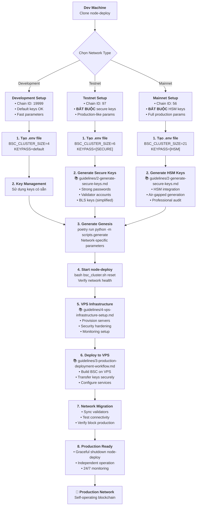

# BSC Node Deploy - Guidelines

Thư mục này chứa các hướng dẫn chi tiết để cấu hình và vận hành BSC blockchain từ development đến production một cách an toàn.

## 📚 Danh Sách Hướng Dẫn

### [0. Change Chain ID](./0-change-chainid.md)

- **Mục đích**: Thay đổi Chain ID hardcoded trong BSC source code
- **Áp dụng**: Development networks
- **Độ khó**: Trung bình
- **Thời gian**: 15-30 phút

### [1. Switch Network Type](./1-switch-network-type.md)

- **Mục đích**: Chuyển đổi giữa Development, Testnet và Mainnet
- **Áp dụng**: Tất cả loại networks
- **Độ khó**: Trung bình
- **Thời gian**: 30-60 phút

### [2. Generate Secure Keys](./2-generate-secure-keys.md)

- **Mục đích**: Tạo và quản lý private keys bảo mật
- **Áp dụng**: Testnet và Mainnet (bắt buộc)
- **Độ khó**: Trung bình đến Khó
- **Thời gian**: 45 phút - 2 giờ

### [3. Production Deployment Workflow](./3-production-deployment-workflow.md) 🆕

- **Mục đích**: Workflow hoàn chỉnh từ node-deploy sang VPS/VDS production
- **Áp dụng**: Team deployment và production operations
- **Độ khó**: Khó
- **Thời gian**: 2-4 giờ

### [4. VPS Infrastructure Setup](./4-vps-infrastructure-setup.md) 🆕

- **Mục đích**: Hướng dẫn chi tiết setup infrastructure VPS/VDS
- **Áp dụng**: Production deployment và scaling
- **Độ khó**: Trung bình đến Khó
- **Thời gian**: 1-3 giờ

## 🚀 Workflow Complete: Development → Production

### Workflow cho Team Development



### Quick Start Paths

#### Cho Development/Testing

```bash
1. [1] Chuyển sang Development mode thủ công
2. Sử dụng keys mặc định
3. Bắt đầu phát triển với node-deploy
```

#### Cho Team Production Deployment

```bash
1. [2] Tạo keys bảo mật thủ công
2. [4] Setup VPS infrastructure
3. [3] Follow production deployment workflow
4. [3] Migration và vận hành độc lập
```

#### Cho Large Scale Production

```bash
1. [2] Tạo keys với HSM/Hardware security
2. [4] Setup multi-region VPS infrastructure
3. [3] Deploy với load balancer và monitoring
4. Professional security audit
5. 24/7 operations team
```

## ⚠️ Cảnh Báo Bảo Mật theo Use Case

### Development

- ✅ Sử dụng keys mặc định OK
- ✅ Commit cấu hình vào git OK
- ⚠️ Chỉ dùng cho testing local

### Team Production

- ❌ **KHÔNG** sử dụng keys mặc định
- ❌ **KHÔNG** commit private keys
- ✅ **BẮT BUỘC** follow [Generate Secure Keys](./2-generate-secure-keys.md)
- ✅ **BẮT BUỘC** follow [Production Workflow](./3-production-deployment-workflow.md)
- ✅ **BẮT BUỘC** setup proper monitoring
- ✅ Backup keys an toàn

### Enterprise Production

- ❌ **KHÔNG** sử dụng keys mặc định
- ❌ **KHÔNG** commit private keys
- ❌ **KHÔNG** sử dụng password yếu
- ✅ **BẮT BUỘC** sử dụng HSM
- ✅ **BẮT BUỘC** professional audit
- ✅ **BẮT BUỘC** insurance coverage
- ✅ **BẮT BUỘC** 24/7 monitoring
- ✅ **BẮT BUỘC** compliance documentation

## 🛠️ Phương Pháp Thủ Công

Tất cả cấu hình được thực hiện bằng tay theo từng bước chi tiết:

### Development Setup

- Chỉnh sửa file `.env` thủ công
- Cập nhật `config.toml`
- Generate genesis configuration
- Kiểm tra và verify settings

### Key Generation

- Tạo password mạnh
- Generate validator accounts với geth
- Tạo BLS keys (cần tools chuyên dụng)
- Set file permissions đúng cách

### Production Infrastructure

- VPS provisioning và hardening
- Load balancer configuration
- SSL/TLS setup
- Monitoring và alerting

### Security Practices

- Manual backup procedures
- File permission management
- Access control setup
- Monitoring configuration

## 📋 Checklist Tổng Quan theo Use Case

### Pre-Deployment Checklist

#### Development ✅

- [ ] Clone repository
- [ ] Build BSC client
- [ ] Tạo file `.env` cho development
- [ ] Run `bsc_cluster.sh reset`
- [ ] Ready to develop!

#### Team Production ⚠️

- [ ] Đọc [VPS Infrastructure Setup](./4-vps-infrastructure-setup.md)
- [ ] Đọc [Production Deployment Workflow](./3-production-deployment-workflow.md)
- [ ] Đọc [Generate Secure Keys](./2-generate-secure-keys.md)
- [ ] Provision VPS infrastructure
- [ ] Setup monitoring và alerting
- [ ] Tạo keys bảo mật mới thủ công
- [ ] Deploy theo production workflow
- [ ] Test deployment thoroughly
- [ ] Setup backup strategies
- [ ] Train team on operations

#### Enterprise Production 🚨

- [ ] Tất cả requirements của Team Production
- [ ] Professional security audit
- [ ] Hardware Security Modules setup
- [ ] Multi-location backup strategy
- [ ] Insurance coverage
- [ ] Incident response plan
- [ ] 24/7 monitoring setup
- [ ] Legal compliance check
- [ ] Disaster recovery testing
- [ ] Team certification

## 🔧 Troubleshooting

### Common Issues

#### "Keys not working"

- Kiểm tra password file
- Verify file permissions
- Check key format
- Ensure proper ownership

#### "Network won't start"

- Clean `.local/` directory
- Check Chain ID consistency
- Verify genesis configuration
- Review all config files

#### "VPS deployment fails"

- Check SSH connectivity
- Verify firewall settings
- Review VPS specifications
- Check disk space

#### "Production sync issues"

- Verify static nodes configuration
- Check network connectivity between VPS
- Review logs for errors
- Ensure proper ports are open

### Getting Help

1. **Check logs**: `tail -f .local/node*/bsc-node.log`
2. **Clean restart**: `rm -rf .local && bash bsc_cluster.sh reset`
3. **Verify configs**: Review `.env`, `config.toml`, `genesis.json`
4. **VPS health check**: Use health check scripts từ [VPS Setup](./4-vps-infrastructure-setup.md)
5. **Community support**: BSC Discord/Telegram groups

## 📖 Additional Resources

### Official Documentation

- [BSC Documentation](https://docs.bnbchain.org/)
- [BSC GitHub](https://github.com/fiotech-labs/bsc)
- [BSC Validator Guide](https://docs.bnbchain.org/docs/validator/overview)

### Security Resources

- [NIST Cryptographic Standards](https://csrc.nist.gov/projects/cryptographic-standards-and-guidelines)
- [OWASP Security Guidelines](https://owasp.org/www-project-top-ten/)
- [Ethereum Security Best Practices](https://consensys.github.io/smart-contract-best-practices/)

### Infrastructure Resources

- [DigitalOcean Tutorials](https://www.digitalocean.com/community/tutorials)
- [AWS Well-Architected Framework](https://aws.amazon.com/architecture/well-architected/)
- [Prometheus Monitoring](https://prometheus.io/docs/)

### Community

- [BSC Forum](https://forum.bnbchain.org/)
- [BSC Discord](https://discord.gg/bnbchain)
- [BSC Telegram](https://t.me/BNBchaincommunity)

---

## 💡 Tips theo Use Case

### Development

- **Luôn backup** trước khi thay đổi
- **Test trên development** trước khi lên production
- **Document** tất cả customizations
- **Use version control** cho configurations

### Team Production

- **Automate deployments** với scripts
- **Monitor** network health liên tục
- **Keep updated** với BSC releases mới
- **Train team** trên operational procedures
- **Plan for scaling** từ đầu

### Enterprise Production

- **Implement CI/CD** pipelines
- **Use Infrastructure as Code** (Terraform/Ansible)
- **Setup comprehensive monitoring** (Prometheus/Grafana)
- **Implement compliance** frameworks
- **Regular security audits**
- **24/7 operations center**

## 🎯 Success Metrics

### Development Success

- [ ] Network khởi động trong < 5 phút
- [ ] RPC responsive và stable
- [ ] Development team có thể iterate nhanh

### Team Production Success

- [ ] Zero-downtime deployment
- [ ] Network stable sau migration
- [ ] Monitoring alerts working
- [ ] Backup/recovery tested
- [ ] Team confident với operations

### Enterprise Production Success

- [ ] 99.9%+ uptime achieved
- [ ] Security audit passed
- [ ] Compliance requirements met
- [ ] Disaster recovery tested
- [ ] Cost optimization implemented
- [ ] Scaling plan validated
